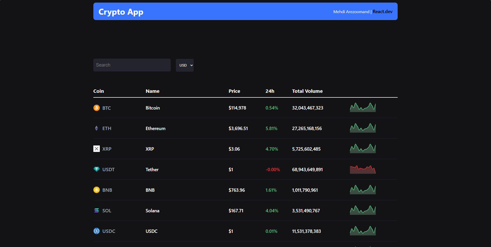
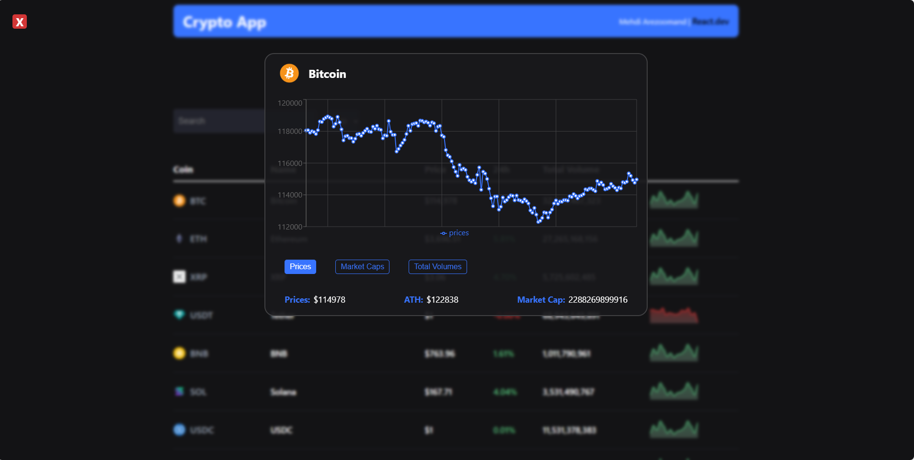
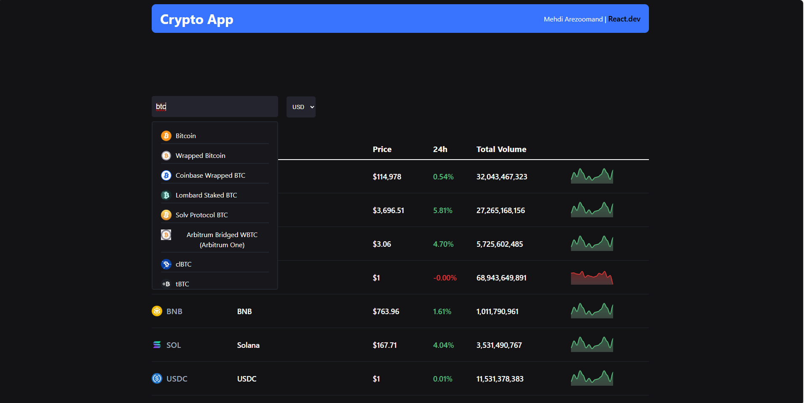

# React + Vite

We are using https://www.coingecko.com/en/api for the backend and fetching data from an API

it has a good document that we can use and it has provided a swagger to test the API : https://docs.coingecko.com/reference/introduction

the view :

chart's view:

search box:

it was a simple crypto web app dont be serious :)
